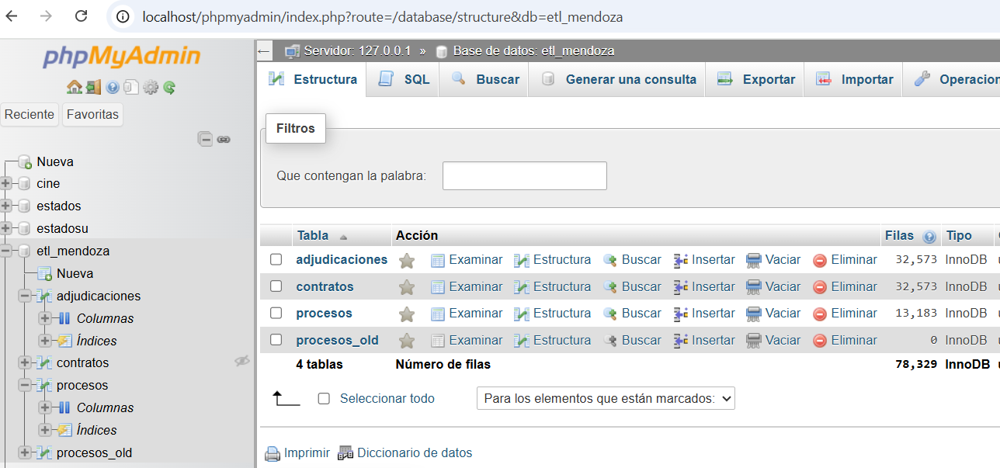

# Proyecto ETL - Contrataciones Públicas de Mendoza

Este proyecto implementa un pipeline ETL utilizando Apache Airflow para descargar, transformar y cargar datos abiertos de contrataciones públicas de la provincia de Mendoza (Argentina), conforme al estándar OCDS (Open Contracting Data Standard).

📊 Dataset
Los datos provienen de fuentes públicas del Gobierno de Mendoza y están estructurados bajo el estándar OCDS.
[Datasets](https://datosabiertos-compras.mendoza.gov.ar/datasets/)

✅ Resultado
Este pipeline permite mantener una base de datos actualizada y limpia con información clave sobre procesos de licitación, adjudicaciones y contratos.

## 📌 Objetivo

Transformar, limpiar y cargar datos abiertos sobre contrataciones públicas en una base de datos MySQL para su análisis posterior.


## 🛠️ Herramientas utilizadas

- **Apache Airflow**: Orquestación de tareas y ejecución programada del flujo ETL.
- **Python 3**: Desarrollo de scripts personalizados.
- **pandas**: Manipulación y transformación de datos.
- **SQLAlchemy + PyMySQL**: Conexión e inserción de datos en base de datos MySQL.
- **MySQL**: Base de datos relacional donde se almacenan los datos procesados.
- **OCDS**: Estándar para estructuración de datos de contrataciones públicas.

## 📁 Estructura del proyecto

```text
airflow_etl_mendoza/
+-- dags/
¦   +-- etl_mendoza.py              # DAG principal
¦   +-- scripts/
¦       +-- cargar_mysql.py
¦       +-- guardar_csvs.py
¦       +-- transformador.py
+-- data/
¦   +-- procesos.csv
¦   +-- adjudicaciones.csv
¦   +-- contratos.csv
+-- tmp/                            # Archivos temporales .pkl
+-- requirements.txt
+-- docker-compose.yml              
+-- .gitignore
+-- README.md
```


## 📊 Tablas principales en la base de datos

- `procesos`: Contiene metadatos generales del proceso de contratación.
- `adjudicaciones`: Información sobre adjudicaciones realizadas.
- `contratos`: Detalles de contratos firmados.


🚧 Docker Compose

El archivo docker-compose.yml incluye contenedores para PostgreSQL (usado por Airflow) y servicios de Airflow Webserver y Scheduler. Airflow se comunica con una base de datos MySQL externa configurada en los scripts.

## 🚀 Cómo ejecutar

1. Instalar dependencias:
   ```bash
   pip install -r requirements.txt
2. Configurar la conexión a MySQL en cargar_mysql.py
3. Ejecutar Airflow:
   ```bash
      airflow db init
      airflow webserver
      airflow scheduler
▶️ Ejecución Local

   git clone https://github.com/Leonardorf/airflow_etl_mendoza.git

   cd airflow_etl_mendoza

   docker-compose up

Luego accedé a Airflow en http://localhost:8080, activá el DAG etl_mendoza y ejecûtalo manualmente o programá su ejecución periódica.
Este proyecto se ejecuta desde el DAG etl_contrataciones_mendoza en el entorno de Airflow. Las tareas incluyen:

Descarga de datos (guardar_csvs)

Transformación (transformador)

Carga en MySQL (cargar_mysql

📊 Dataset

Los datos provienen de fuentes públicas del Gobierno de Mendoza y están estructurados bajo el estándar OCDS. Incluyen procesos de contratación, adjudicaciones y contratos.

✅ Resultado

Este pipeline permite mantener una base de datos estructurada y actualizada con información clave sobre licitaciones, ideal para análisis de transparencia, eficiencia del gasto público y oportunidades de mejora.





## 📌 Licencia
MIT
